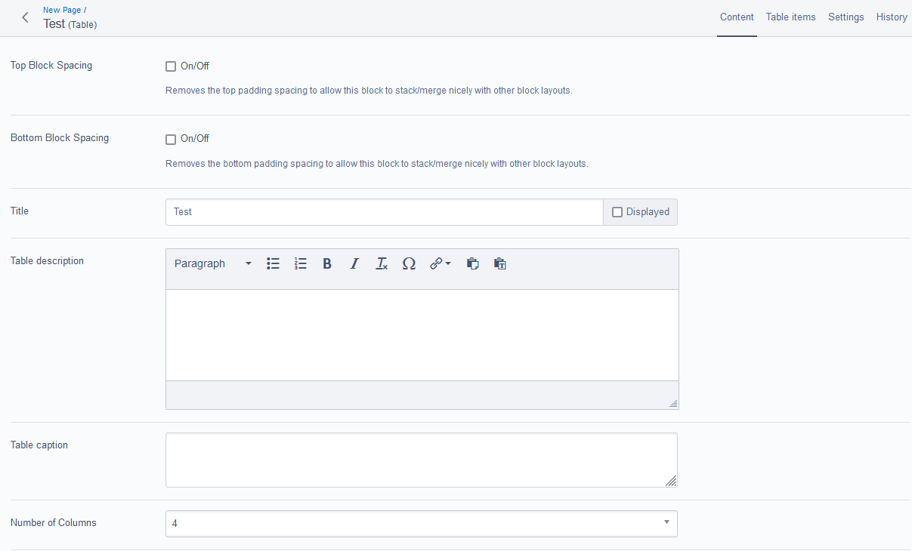

# Signify SilverStripe Factory Elemental Table Block

An elemental block to enable more control over the responsiveness of tables.

## Require via composer.json

```json
"repositories": [
    {
        "type": "vcs",
        "url": "git@gitea:Factory/silverstripe-factory-elemental-tables.git"
    }
],
"require": {
    "signify-nz/silverstripe-factory-elemental-tables": "dev-master"
}
```

## Usage

### Content editable fields

* Title
* Description field
* Caption field

### Settings

* Set the Number of Columns
* Set the Number of Rows
* Provide the CSS classes for alignments and styles, e.g. "Zebra rows"
* Set the width for each column

### Enable RichLinks for CWP site

In your ```_config.yml``` file

```yml
Signify\Factory\Models\TableBlock:
  enable_rich_links: true
```

### Styles

You need to add CSS styles on your site to theme the table block.

### Screenshots

Main content


Edit cells


Settings


